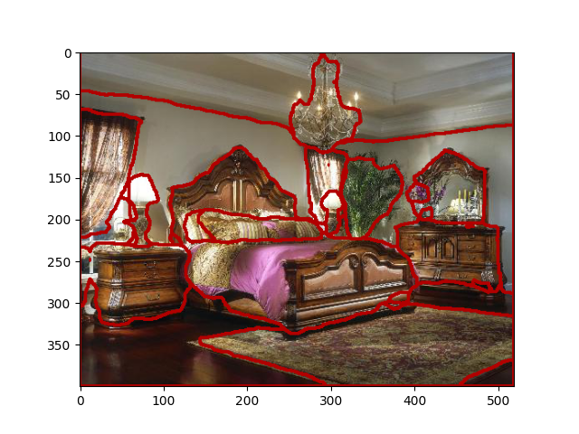

# python-extension-example

This is a minimal example to build a Python extension that uses both numpy and opencv. In some applications, postprocessing can be cpu-intensive, e.g. drawing contours for image segmentation moidels. These logics can be implemented in C++ to better utilize multi-core.

This example demonstrates:

* How to interface between Python and C++
* How to convert a numpy array to cv::Mat with zero copy
* How to write a [setup.py](./setup.py) to set proper include directories and link libraries.
* How to call opencv/numpy functions in C++, parse Python variables and construct returning variables.

## How to use

### Environment

Use conda to manage dependencies, make sure you run the setup.py inside an active conda environment. You also need to install numpy and opencv, e.g. ```conda install -c conda-forge opencv```

### Build the extension locally

```
python setup.py build_ext --inplace
```

### Run the example code

```python test_example.py```

## Expected result

